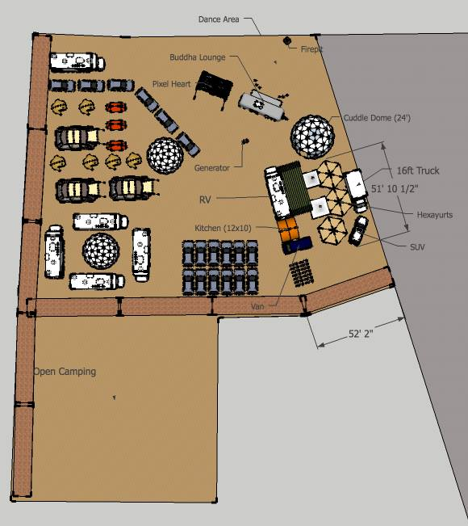
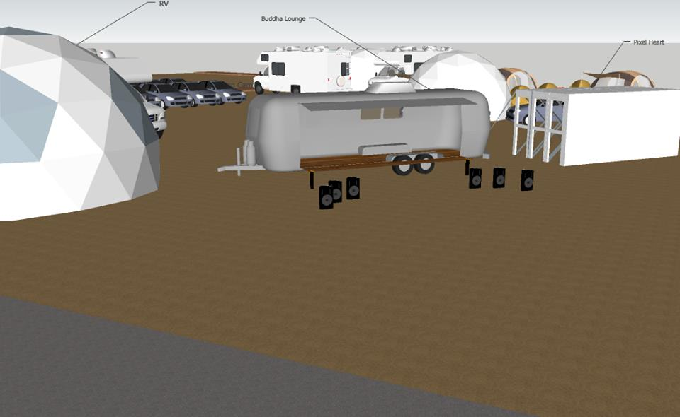
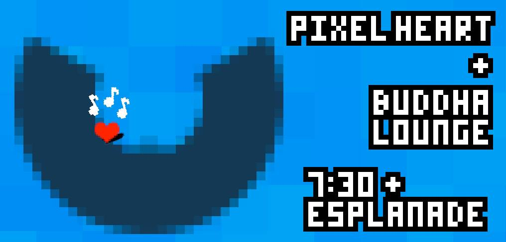
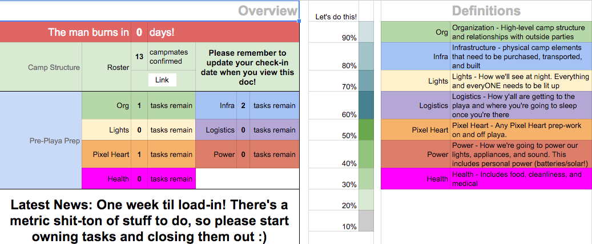

# Pixel Heart on the Esplanade

> A chapter of featherless' [digital creative history](https://github.com/featherless/digital-creative-history).

- When: August 23 to September 2, 2013
- Where: Black Rock City, Nevada, USA

Burning Man 2013 was my second year on the playa and my first year organizing a camp. We had
thirteen camp members including myself and we brought all of our own infrastructure.

## Camp schematic

Made these stickers for camp members to put on their bikes:

## The gear

- the Pixel Heart
- 3 yurts
- 1 geodesic dome
- a generator
- swamp coolers
- speakers
- sound-reactive dome lights
- electrical equipment

## Organization

Most of the camp was based out of San Francisco but I was in Montreal in the months leading up to
the burn. We had to do a lot of over-the-internet planning especially given that we were
coordinating with another camp: Buddha Lounge. Spreadsheets to the rescue!

# License

This repository and its contents are licensed under [CC BY 2.0](http://creativecommons.org/licenses/by/2.0/).

> A chapter of featherless' [digital creative history](https://github.com/featherless/digital-creative-history).
